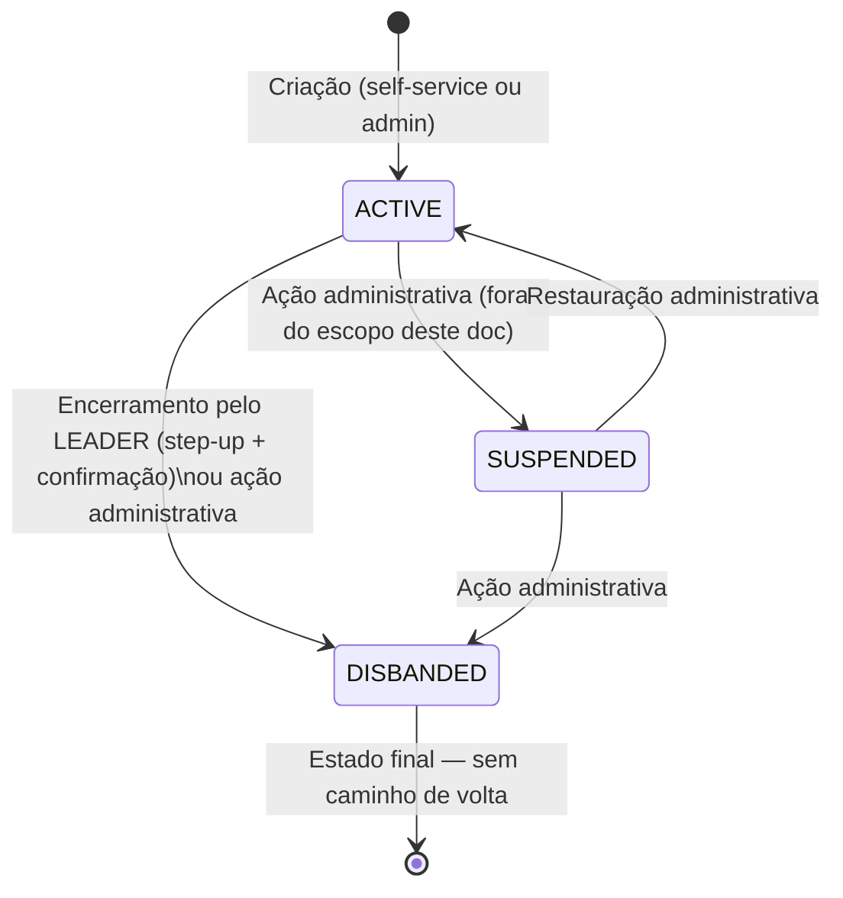
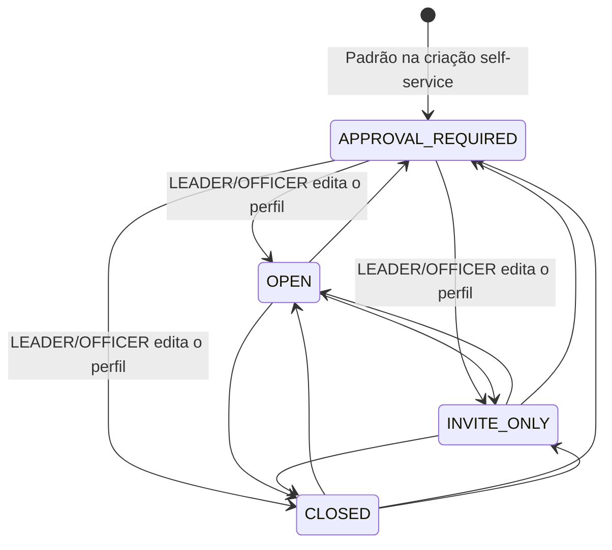
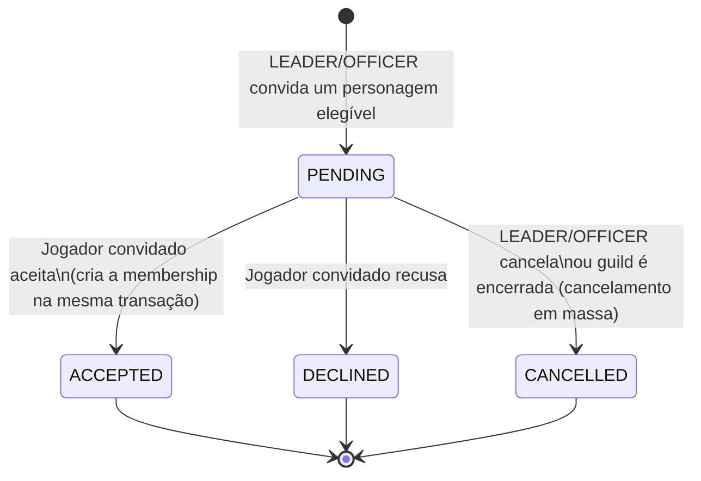
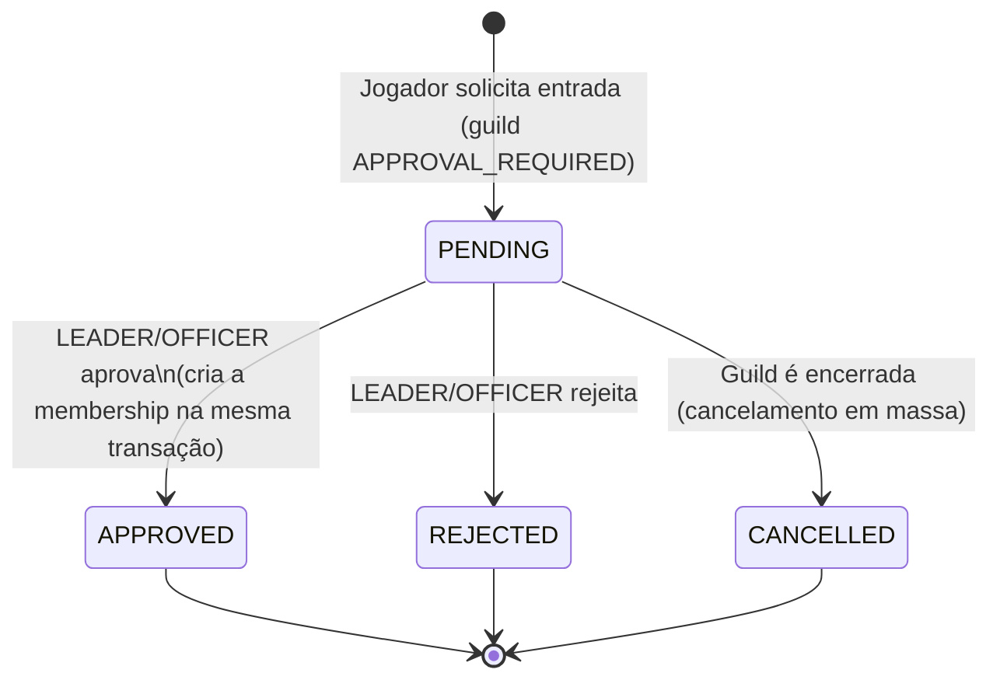
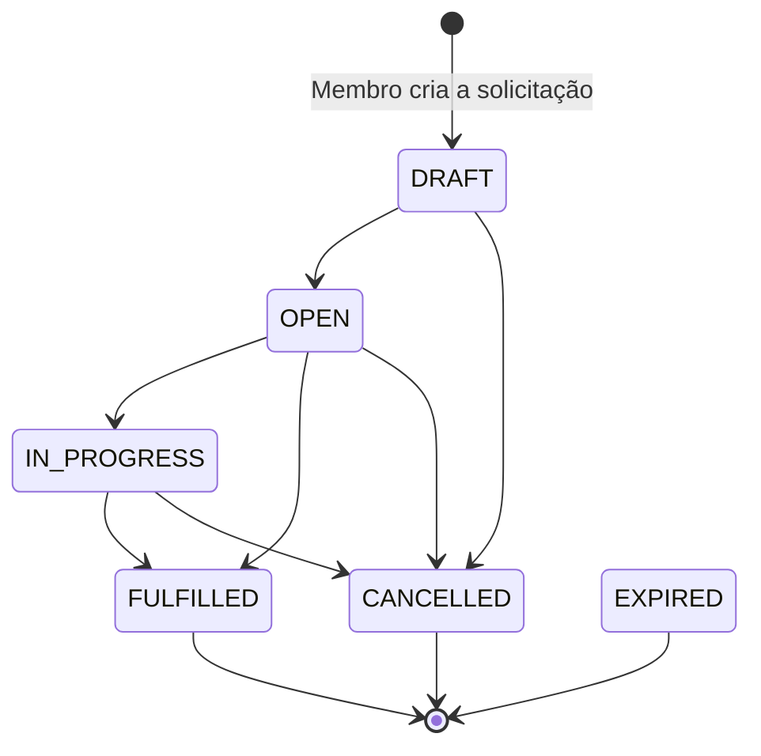
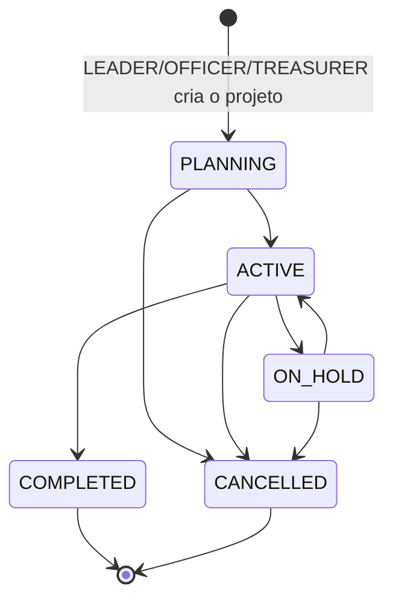
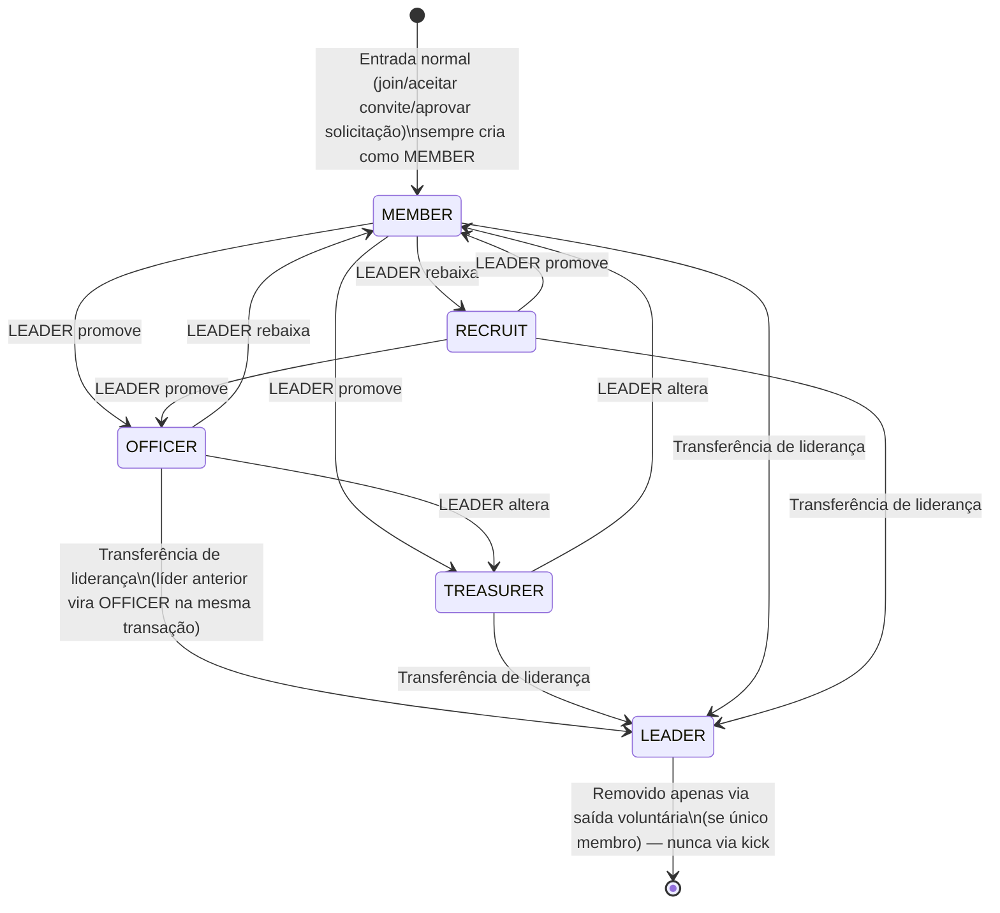

# Guild — Fluxos e Transições de Estado

**Status:** BETA READY · **Baseline commit:** `a2c8e77` · **Última revisão:** 2026-08-18

> Todos os estados e transições abaixo correspondem exatamente aos enums e à lógica real do backend (`schema.prisma`, `guilds.service.ts`). Nenhum estado foi inventado.

## Ciclo de vida da Guild

`GuildStatus`: `ACTIVE` | `DISBANDED` | `SUSPENDED`

`DISBANDED` é um estado final para o LEADER/jogador comum: não existe nenhum caminho no domínio de guild do jogador para reverter um encerramento. `SUSPENDED` é exclusivamente administrativo (painel de staff, fora do escopo deste conjunto de documentos voltado ao jogador).

## Modo de Recrutamento

`GuildRecruitmentStatus`: `OPEN` | `APPROVAL_REQUIRED` | `INVITE_ONLY` | `CLOSED`

Transição livre entre os quatro modos, a qualquer momento, por quem pode editar o perfil (LEADER/OFFICER) — não há restrição de "não pode voltar" nem cooldown entre trocas.

## Convite (`GuildInvite`)

`GuildInviteStatus`: `PENDING` | `ACCEPTED` | `DECLINED` | `CANCELLED`

Um segundo convite ao mesmo personagem, pela mesma guild, enquanto o primeiro segue `PENDING`, **atualiza a mesma linha** (mesmo `id`) em vez de criar um novo convite — não existe um estado de "convite duplicado".

Não existe hoje nenhuma transição automática por tempo (sem TTL/expiração) — um convite `PENDING` permanece assim indefinidamente até uma decisão humana ou o encerramento da guild.

## Solicitação de Entrada (`GuildJoinRequest`)

`GuildJoinRequestStatus`: `PENDING` | `APPROVED` | `REJECTED` | `CANCELLED` | `EXPIRED`

> **Nota de precisão**: o enum inclui um valor `EXPIRED`, mas **nenhum código atual atribui esse status** — não existe mecanismo de expiração por tempo implementado. Ele existe no schema como possibilidade futura, não como comportamento ativo hoje.

Assim como o convite, uma segunda solicitação do mesmo personagem para a mesma guild enquanto a primeira segue `PENDING` **atualiza a mesma linha** em vez de criar uma nova.

## Solicitação de Recurso (`GuildRequest`) — não confundir com Solicitação de Entrada

`GuildRequestStatus`: `DRAFT` | `OPEN` | `IN_PROGRESS` | `FULFILLED` | `CANCELLED` | `EXPIRED`

O formulário atual de criação sempre cria em `DRAFT`. A transição para `OPEN`/`IN_PROGRESS`/`FULFILLED` depende de uma edição manual (`PATCH`) enviando o novo `status` explicitamente — não existe fluxo guiado na UI atual para essas transições além do formulário genérico de edição. `EXPIRED` sofre da mesma observação do `GuildJoinRequest`: existe no enum, sem mecanismo de atribuição automática implementado.

## Projeto (`GuildProject`)

`GuildProjectStatus`: `PLANNING` | `ACTIVE` | `ON_HOLD` | `COMPLETED` | `CANCELLED`

`COMPLETED` e `CANCELLED` são estados finais — um projeto nesses status não pode mais ser editado.

## Papel de Membro (`GuildMember.roleKey`) — transições relevantes

Não é um enum de banco (campo texto livre, vocabulário validado na camada de serviço: `LEADER`, `OFFICER`, `TREASURER`, `MEMBER`, `RECRUIT`), mas as transições reais seguem um fluxo previsível:

Pontos importantes não óbvios no diagrama:
- **Toda entrada nova começa como `MEMBER`** — nenhum fluxo real de entrada atribui `RECRUIT` automaticamente.
- **`LEADER` só é alcançado via transferência de liderança**, nunca via o seletor de papel comum (que nem lista essa opção).
- **Sair de `LEADER`** só acontece como efeito colateral de uma transferência de liderança (o líder anterior vira `OFFICER` automaticamente) — nunca há uma transição direta "LEADER → qualquer outro papel" fora desse fluxo.
